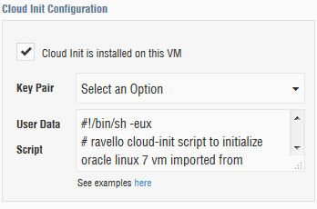

# Ravello
Utilities for working with Ravello

- [bootstrap_ol7_cloud_init.sh](bootstrap_ol7_cloud_init.sh) - Installs [cloud-init](https://cloud-init.io/) to Oracle Linux 7
- [ravello-cloud-init-ol73.sh](ravello-cloud-init-ol73.sh) - A cloud-init script the does the following:
	- Enables the Ethernet connection
	- Enables RSA public key authentication and disables SSH password authentication
	- Adds SSH public keys to the authorized keys file
	- Optimizes the shutdown process

## Usage

- As root, run [bootstrap_ol7_cloud_init.sh](bootstrap_ol7_cloud_init.sh) on the VM you wish to import into Ravello
- Import the VM to Ravello
- Tweak the [ravello-cloud-init-ol73.sh](ravello-cloud-init-ol73.sh) to suite your needs (e.g., add your public key)
- Copy the [ravello-cloud-init-ol73.sh](ravello-cloud-init-ol73.sh) to the Cloud Init Configuration of your imported VM. This can be done during VM Verification or afterwards.

	
